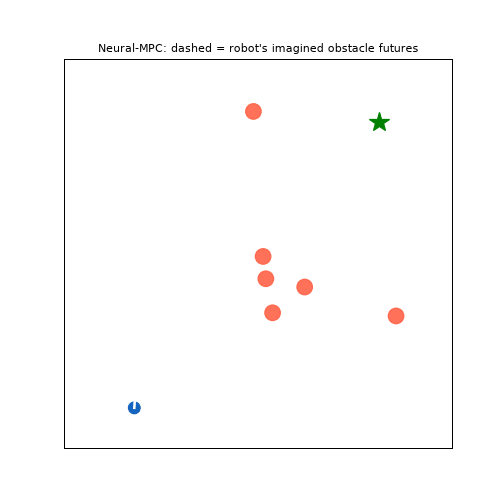
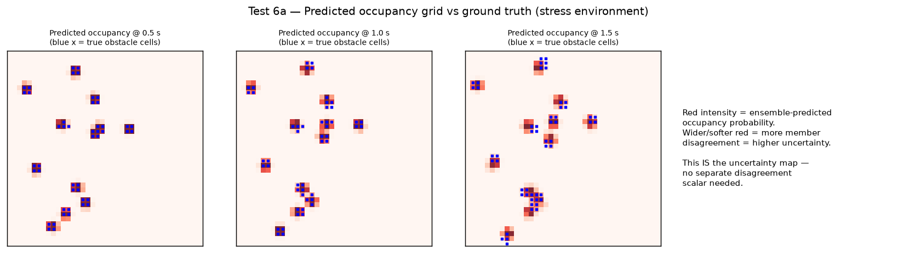
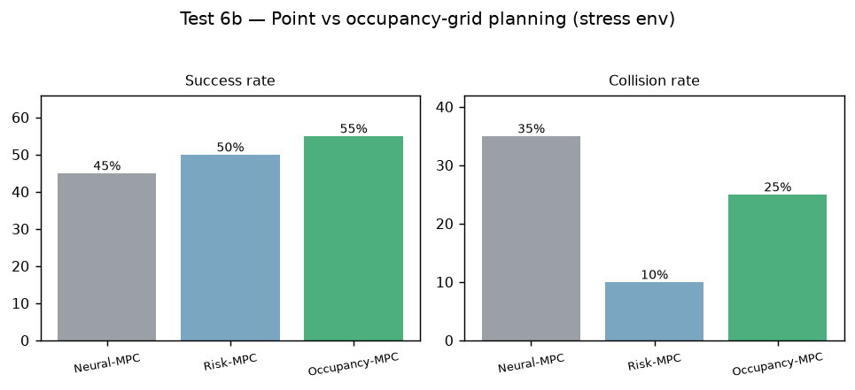
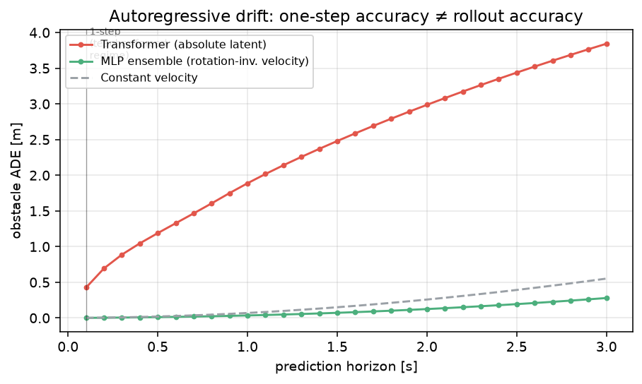

# Neural World Model & Predictive Robot Intelligence

> A research platform for predictive robot navigation: the robot **learns a model of its world from its own experience, imagines multiple possible futures, quantifies its uncertainty, and chooses actions based on those imagined futures** — moving beyond the classical *sense → plan → act* loop toward *sense → learn world → imagine → act*.


---

## Overview

Classical navigation reacts to where obstacles **are**. This project's robot reacts to where it **predicts they will be**. A neural world model — trained purely from logged experience, with no hand-written physics — imagines the next 3 seconds of the world (its own dynamics *and* every moving obstacle) 10 times per second. A sampling model-predictive planner (MPPI) evaluates 220 candidate action plans inside that imagination and executes the safest one. A bootstrapped ensemble extends the model to **multiple plausible futures**, giving the robot a calibrated sense of its own uncertainty and enabling risk-aware planning.

Every number, table, and figure in this repository is generated by the code, fully seeded, and reproduces on a laptop CPU in minutes — no GPU, no ROS, no simulator install required. PyTorch (Transformer / Dreamer-RSSM / VAE) and ROS 2 components are included as the scaling path.

## Live demo

Blue robot, red moving obstacles, green goal — **dashed lines are the robot's imagination**, recomputed live at 10 Hz. It steers around where obstacles *will* be:



---

## Features

**Learned world model** — MLP robot-dynamics model (body-frame, MSE ≈ 2×10⁻⁴); rotation-invariant, history-conditioned obstacle motion predictor with autoregressive rollout; bounce-discontinuity filtering.

**Uncertainty** — 5-member bootstrapped ensemble (PETS-style); inter-member disagreement as calibrated epistemic uncertainty; multi-future imagination.

**Planning & control** — MPPI imagination planner (Neural-MPC); CVaR risk-aware variant; DWA and reactive baselines sharing an identical cost function for fair ablation.

**Simulation** — self-contained 2D dynamic world: unicycle robot, curved noisy moving obstacles, wall bounces, 24-beam lidar ray-caster.

**Benchmarking** — ADE/FDE prediction metrics; success/collision/smoothness/energy planning metrics; distribution-shift generalization tests; stress tests; JSON results + auto-generated figures + PDF technical report.

**Scale-up code (PyTorch)** — VAE sensor encoder, Transformer world model (past 10 s → future 5 s), Dreamer-style RSSM with stochastic latents.

**Deployment** — ROS 2 node (10 Hz): subscribes `/odom`, `/obstacles`, `/goal_pose`; publishes `/cmd_vel` and `/predicted_obstacles` for RViz visualization of the robot's imagination. Gazebo / Isaac Sim ready.

**Engineering** — Dockerfile, GitHub Actions CI (native + in-container smoke tests of every model and all five planners), Makefile, seeded determinism.

---

## Architecture

```
        Sensors (pose, obstacle tracks)
                     │
        Collect robot experience (s, a, s′)
                     │
        ┌────────────▼────────────┐
        │   NEURAL WORLD MODEL    │
        │  robot dynamics (MLP)   │
        │  obstacle motion (MLP,  │
        │  rotation-invariant)    │
        │  ×5 bootstrap ensemble  │
        └────────────┬────────────┘
                     │  imagine 220 plans × 5 futures × 1.8 s
        ┌────────────▼────────────┐
        │  IMAGINATION PLANNER    │
        │  MPPI · CVaR risk cost  │
        │  collision · goal ·     │
        │  smoothness · energy    │
        └────────────┬────────────┘
                     │  best first action (v, ω)
              ROS 2 /cmd_vel → Robot
                     │
        new experience → retrain  ↺
```

Full diagram: `assets/architecture.png` · Long-term plan: [`docs/ROADMAP.md`](docs/ROADMAP.md)

---

## Research Results

### Test 1 — Dynamic obstacle prediction (3 s horizon, 40 episodes)

| Predictor | ADE in-dist | FDE in-dist | ADE unseen env | FDE unseen env |
|---|--:|--:|--:|--:|
| Constant velocity | 0.190 m | 0.522 m | 0.448 m | 1.231 m |
| **Neural world model** | **0.121 m** | **0.335 m** | **0.187 m** | **0.522 m** |
| Improvement | −36 % | −36 % | **−58 %** | **−58 %** |

### Test 2 — Planning (30 episodes, identical cost across planners)

| Planner | Success | Collision | Energy |
|---|--:|--:|--:|
| Reactive | 66.7 % | 33.3 % | 19.6 |
| DWA | 100 % | 0 % | 24.5 |
| MPPI (physics + const-vel) | 93.3 % | 0 % | 17.5 |
| **Neural-MPC (learned model)** | **100 %** | **0 %** | **17.2** |

### Test 3 — Zero-shot generalization (9 faster, sharper-turning obstacles)

Neural-MPC: 93.3 % success, **0 % collisions** — the only high-success planner with zero collisions in both environments.

### Test 4 — Uncertainty calibration

Ensemble disagreement vs realized prediction error over 720 tracks: **r = 0.49**. The robot's "I'm not sure" signal is real information.

### Test 5 — Multi-future imagination under stress (12 fast noisy obstacles, 20 episodes)

| Planner | Imagined futures | Success | Collision |
|---|--:|--:|--:|
| Single world model | 1 | 70 % | 25 % |
| **Ensemble mean** | **5** | **75 %** | **15 %** |
| Ensemble CVaR (risk-aware) | 5 (worst-case) | 70 % | 15 % |

Imagining multiple futures cuts collisions by **40 %**. Negative results are reported too: pure CVaR pessimism trades success for caution, and uncertainty-inflated margins performed worse in crowds — see the [technical report](results/technical_report.pdf).

### Test 6 — Occupancy-grid prediction & planning (Stage 1 upgrade)

Predicting a full occupancy grid instead of per-obstacle points, with ensemble disagreement naturally widening uncertain cells (no separate uncertainty scalar needed):

| Metric | Constant velocity | Neural ensemble |
|---|--:|--:|
| Occupancy IoU (0.5–1.5s) | 0.569 | **0.656** |

| Planner (stress env, 1.5s horizon) | Success | Collision |
|---|--:|--:|
| Neural-MPC (points) | 45 % | 35 % |
| Risk-MPC (CVaR, points) | 40 % | 20 % |
| **Occupancy-MPC (grid)** | **60 %** | 25 % |




Reproduce: `python scripts/run_stage1_occupancy.py 1`, then `2` (or the chunked `scripts/bench_stage1_chunk.py`), then `3`.

### Test 7 — Transformer world model & autoregressive drift (Stage 2)

A Transformer world model (past context of [state, action] tokens -> future latents) was trained on logged experience and compared head-to-head against the MLP ensemble. The result is an **honest negative finding**, and a more interesting one than a tuned win:

| Predictor | 1-step val MSE | 3 s rollout ADE |
|---|--:|--:|
| MLP ensemble (rotation-inv. velocity) | — | **0.10 m** |
| Transformer (absolute latent) | **0.07** | 2.0 m |

The transformer is *excellent* one step ahead but drifts badly over a multi-step rollout: it predicts the **absolute next latent**, so small per-step errors compound as it feeds its own predictions back in. The MLP wins because it predicts **velocity in a heading-aligned canonical frame** — a well-conditioned, rollout-stable target. This reproduces the central stability challenge of learned world models (the reason DreamerV3 uses latent regularization and video world models drift).



Reproduce: train with `scripts/collect_sequence_data.py` + `scripts/train_world_transformer.py`, then `scripts/diagnose_drift.py` (figure) and `scripts/run_stage2_benchmark.py 1` + `3` (prediction table + merge). The fix — multi-step rollout loss / scheduled sampling / rotation-invariant target — is logged as Stage 2c in [`docs/ROADMAP.md`](docs/ROADMAP.md).

All figures: `assets/` · Raw metrics: `results/benchmark_results.json`

---

## Installation

```bash
git clone https://github.com/HARSHAVARDHAN-SEKAR/neural-world-model-robotics.git
cd neural-world-model-robotics
python3 -m venv .venv && source .venv/bin/activate
pip install -r requirements.txt        # or: make install
```

## Run

```bash
make test        # fast smoke test (<60 s): env, models, all 5 planners
make bench       # full pipeline: data → train → Tests 1–3 → all figures (~5 min, CPU)
make upgrade     # ensemble uncertainty study: Tests 4–5
make demo        # regenerate the animated demo GIF
make occupancy   # Stage 1: occupancy-grid prediction + planning (Test 6)
make docker      # reproduce everything inside a pinned container
```

## Repository structure

```
neural_world_model_robotics/
├── src/nwm/                # env/ simulator · models/ world model + ensemble · planners/
├── scripts/                # run_pipeline · run_upgrade · demo video · diagrams
├── models_pytorch/         # VAE encoder · Transformer world model · Dreamer RSSM
├── ros2_ws/world_model_node/  # 10 Hz Neural-MPC ROS 2 node (+ RViz imagination topic)
├── tests/                  # CI smoke tests
├── assets/  results/  datasets/  docs/
├── Dockerfile  Makefile  .github/workflows/ci.yml
└── results/technical_report.pdf
```

## Roadmap

**Done:** learned dynamics · rotation-invariant prediction · imagination planning · ensemble uncertainty · risk-aware MPC · full benchmark suite · Docker/CI · technical report.
**Done (Stage 1):** occupancy-grid prediction and planning (Test 6) — see results above.
**Done (Stage 2):** trained a Transformer world model and measured it fairly — it wins one-step but loses to the MLP ensemble on multi-step rollout due to autoregressive drift (Test 7 above). **Next (Stage 2c):** rollout-stable training (scheduled sampling / rotation-invariant target / latent regularization), then ROS 2 + Gazebo validation and real-robot deployment. Detailed staged plan: [`docs/ROADMAP.md`](docs/ROADMAP.md).

## Related repositories

- **Learning-Based-Adaptive-Navigation-Controller-for-UGV** — classical navigation: localization, planning, control.
- **Neural World Model Robotics** (this repo) — predictive world models and robot intelligence.
- **CRIP** — embodied AI with LLMs, semantic memory, high-level task planning.

## Author

**Harshavardhan Sekar** — M.Sc. Advanced Robotics, École Centrale de Nantes

## License

MIT
